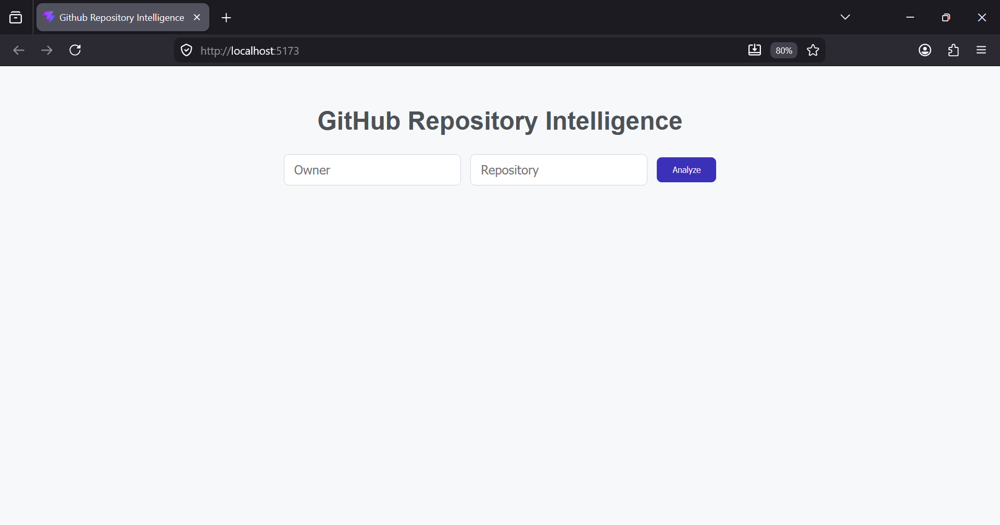
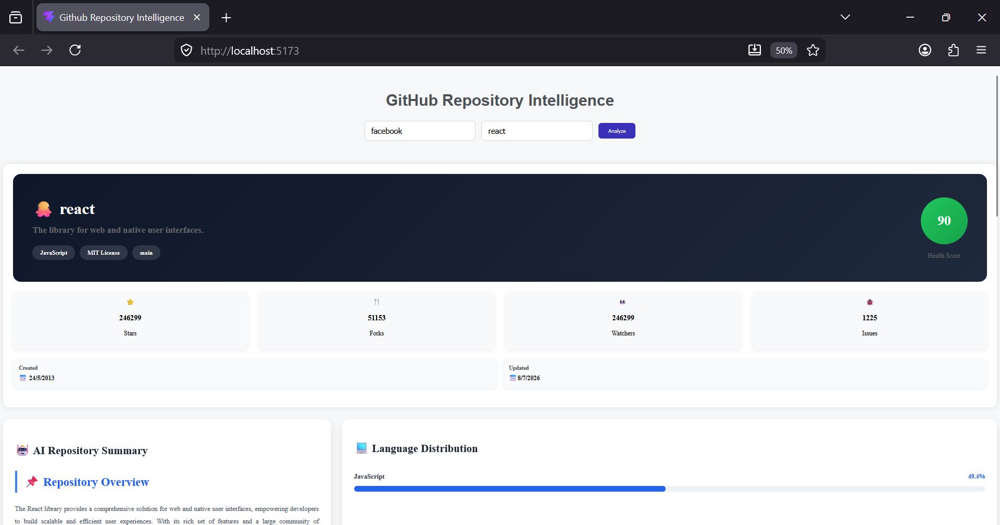
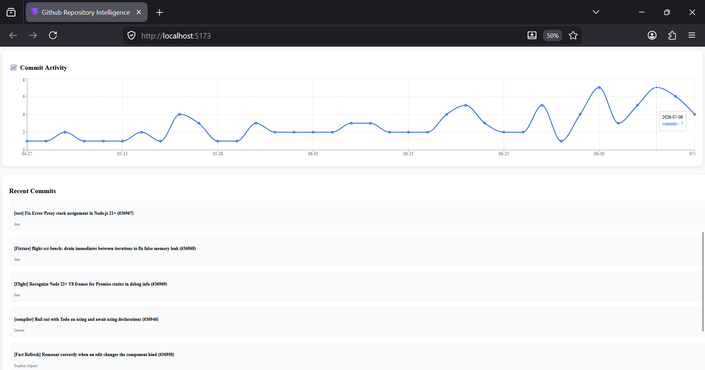
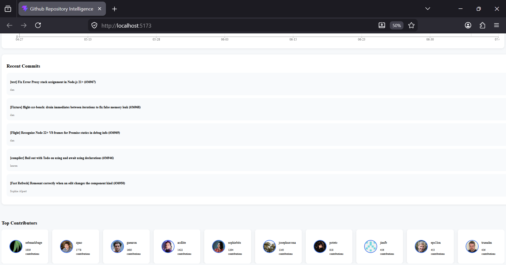
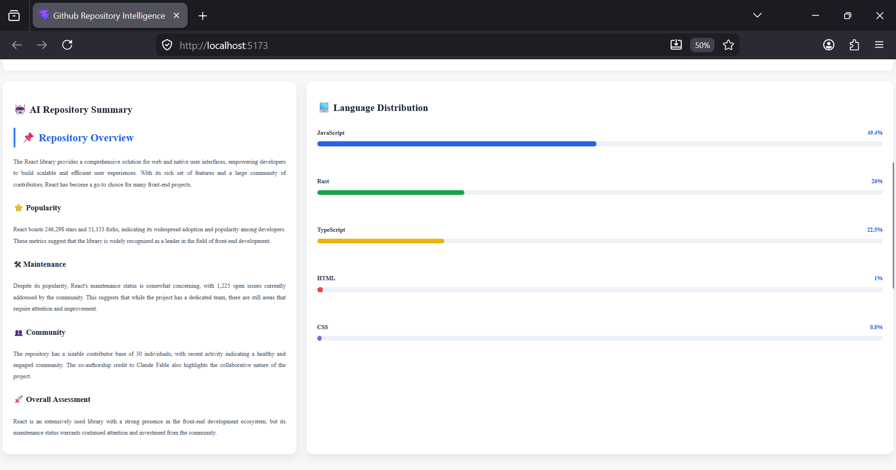

# 🚀 GitHub Repository Intelligence System

A full-stack web application that analyzes any public GitHub repository and presents meaningful insights through an interactive dashboard. It uses the GitHub REST API and an LLM-powered backend to generate repository summaries, visualize activity, and evaluate repository health.

---

## 📌 Features

- 🔍 Search any public GitHub repository
- ⭐ View repository details
  - Repository name
  - Description
  - Primary language
  - Stars
  - Forks
  - Watchers
  - Open Issues
  - License
  - Default Branch
  - Created & Updated Date
- 👥 Display Top Contributors
- 📜 View Recent Commits
- 📊 Commit Activity Chart
- 💻 Language Distribution Chart
- ❤️ Repository Health Score
- 🤖 AI Generated Repository Summary using a locally running LLM
- ⚡ Responsive and modern user interface

---

## 🛠 Tech Stack

### Frontend

- React.js
- Axios
- Chart.js
- CSS3

### Backend

- Node.js
- Express.js
- GitHub REST API
- Axios
- Local LLM (Llama/Ollama)

---

## 📂 Project Structure

```
GitHub-Repository-Intelligence-System
|
├── github-intelligence-frontend
│   ├── src
│   ├── public
│   └── package.json
│
├── server
│   ├── index.js
│   ├── package.json
│   └── .env
│
└── README.md
```

---

## 🚀 Installation

### 1. Clone Repository

```bash
git clone https://github.com/Kapil778/GitHub-Repository-Intelligence-System.git
```

```
cd GitHub-Repository-Intelligence-System
```

---

### 2. Install Backend Dependencies

```bash
cd server
npm install
```

---

### 3. Install Frontend Dependencies

```bash
cd ../github-intelligence-frontend
npm install
```

---

### 4. Create Environment Variables

Create a `.env` file inside the **server** folder.

```env
GITHUB_TOKEN=your_github_token
PORT=5000
```

---

### 5. Start Backend

```bash
cd server
npm start
```

Backend runs at

```
http://localhost:5000
```

---

### 6. Start Frontend

```bash
cd github-intelligence-frontend
npm run dev
```

Frontend runs at

```
http://localhost:5173
```

---

## 📡 API Endpoints

| Endpoint | Description |
|-----------|-------------|
| `/repo/:owner/:repo` | Repository Details |
| `/contributors` | Top Contributors |
| `/commits` | Latest Commits |
| `/activity` | Commit Activity |
| `/languages` | Language Distribution |
| `/health` | Repository Health Score |
| `/summary` | AI Repository Summary |

---

## ❤️ Repository Health Score

The application computes a repository health score using multiple repository metrics:

- ⭐ Stars
- 🍴 Forks
- 👥 Contributors
- 📜 Recent Commits
- 🐞 Open Issues

The score provides a quick overview of repository quality and activity.

---

## 🤖 AI Repository Summary

The backend generates an intelligent repository summary using a locally running Large Language Model.

The AI analyzes:

- Project purpose
- Repository popularity
- Maintenance status
- Community activity
- Overall assessment

---

## 📸 Screenshots

| Home | Dashboard |
|------|-----------|
|  |  |

| Contributors | Activity |
|-------------|----------|
|  |  |

### 🤖 AI Repository Summary 


---

## 🔮 Future Improvements

- Repository comparison
- User authentication
- Search history
- Trending repositories
- Repository bookmarking
- Export reports as PDF
- Commit heatmap
- Pull request analytics
- Issue analytics
- Docker deployment

---

## 🧪 Testing

Test backend APIs using:

- Postman
- Thunder Client
- Browser

Example:

```
GET http://localhost:5000/repo/facebook/react
```

---

## 💡 Challenges Faced

- Handling GitHub API rate limits
- Designing a repository health scoring algorithm
- Processing commit activity efficiently
- Integrating AI-generated summaries
- Creating responsive data visualizations

---

## 👨‍💻 Author

**Kapil Sharma**

GitHub: https://github.com/Kapil778

Email: kapilsharma7798765@gmail.com

LinkedIn: https://www.linkedin.com/in/kapil-sharma-470aba338

---

## ⭐ Support

If you found this project useful, consider giving it a ⭐ on GitHub.
